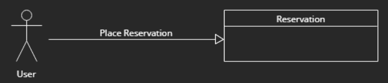
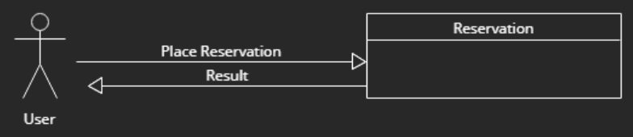
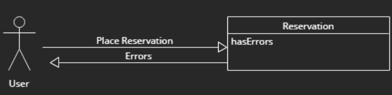
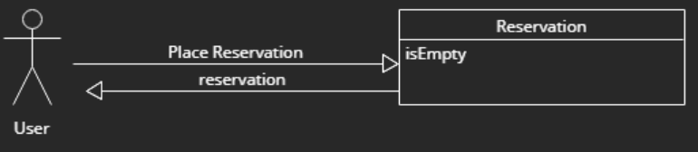

# Film Reservation

## Motivation

We have decided us for a film reservation application, because we found it a good way to demonstrate our skills and our creativity

## Layout Sketch

We have planned that we are going to add a header and a footer. The Center part (Input) is for our input for the reservation. 

The Output/Result is going to be almost the same as the input, but the content-size being used is smaller

## Gui Sketch

The "Select Movie" is a dropdown with a list of movies to select. Everything on this input list cannot be empty, and has some sort of validation.

Here you can see, that the output, is very similar to the input, except that there is no dropdown, that's why the content is smaller.

## Use Cases

User is able to place a reservation.

User can place a reservation and get a result back, with the confirmed reservation, with his entered data.

If the reservation has errors, or it doesn't fullfill the validation, errors will be returned.

If the input is empty, the same page will be returned, to fill the blanks.